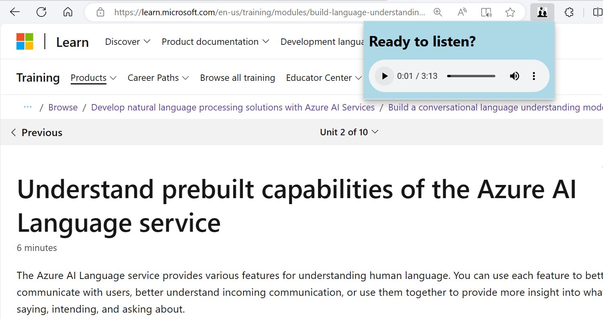

# Conversation helper

Tired of reading lengthy pieces of content when using your browser? Tired of listening to the "read aloud" monotone speech?

Enter this Microsoft Edge extension, where the aim is to be able to listen to a conversation between 2 persons that discuss the article you're currently reading in your browser!

Here is how it could work:

1. Add the extension to your browser (Enable developer mode and load an unpacked folder, point it to the ConversationExtension folder)
2. (Deploy) and run the Azure Function. This function is responsible for reading the content of the URL, creating the conversation transcript and returning the text to speech